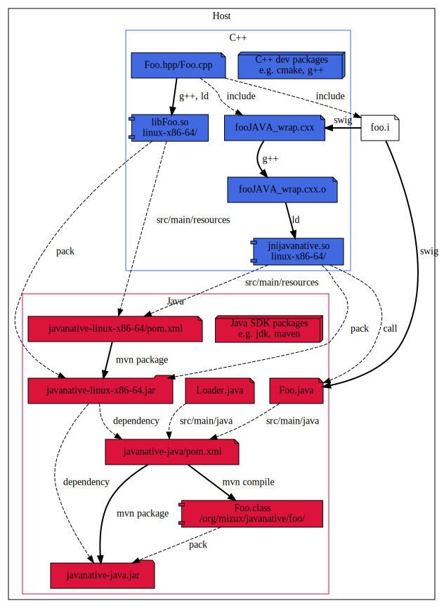

[![Build Status][docker_status]][docker_link]
[![Status][linux_svg]][linux_link]
[![Status][osx_svg]][osx_link]
[![Status][win_svg]][win_link]

[docker_status]: https://github.com/Mizux/java-native/workflows/Docker/badge.svg
[docker_link]: https://github.com/Mizux/java-native/actions?query=workflow%3A"Docker"
[linux_svg]: https://github.com/Mizux/java-native/workflows/Linux/badge.svg
[linux_link]: https://github.com/Mizux/java-native/actions?query=workflow%3A"Linux"
[osx_svg]: https://github.com/Mizux/java-native/workflows/MacOS/badge.svg
[osx_link]: https://github.com/Mizux/java-native/actions?query=workflow%3A"MacOS"
[win_svg]: https://github.com/Mizux/java-native/workflows/Windows/badge.svg
[win_link]: https://github.com/Mizux/java-native/actions?query=workflow%3A"Windows"

# Introduction
This project aim to explain how you build a Java 1.8 native (for win32-x86-64, linux-x86-64 and darwin) maven multiple package using [`mvn`](http://maven.apache.org/) and few [POM.xml](http://maven.apache.org/pom.html).  
e.g. You have a cross platform C++ library and a JNI wrapper on it thanks to SWIG.  
Then you want to provide a cross-platform Maven package to consume it in a Maven project...

## Table of Content
* [Requirement](#requirement)
* [Directory Layout](#directory-layout)
* [Build Process](#build-process)
  * [Local Package](#local-package)
    * [Building a native Package](#building-local-native-package)
    * [Building a Local Package](#building-local-package)
    * [Testing the Local Mizux.Foo Package](#testing-local-package)
* [Appendices](#appendices)
  * [Ressources](#ressources)
* [Misc](#misc)

# Requirement
You'll need a "Java SDK >= 1.8" and "Maven >= 3.0".

# Directory Layout
The project layout is as follow:

* [CMakeLists.txt](CMakeLists.txt) Top-level for [CMake](https://cmake.org/cmake/help/latest/) based build.
* [cmake](cmake) Subsidiary CMake files.

* [ci](ci) Root directory for continuous integration.

* [Foo](Foo) Root directory for `Foo` library.
  * [CMakeLists.txt](Foo/CMakeLists.txt) for `Foo`.
  * [include](Foo/include) public folder.
    * [foo](Foo/include/foo)
      * [Foo.hpp](Foo/include/foo/Foo.hpp)
  * [java](Foo/java)
    * [CMakeLists.txt](Foo/java/CMakeLists.txt) for `Foo` Java.
    * [foo.i](Foo/java/foo.i) SWIG Java wrapper.
  * [src](Foo/src) private folder.
    * [src/Foo.cpp](Foo/src/Foo.cpp)
* [java](java) Root directory for Java template files
  * [base.i](java/base.i) Generic SWIG stuff (e.g. fixing int64 java typemaps).
  * [pom-native.xml.in](java/) POM template to build the native project.
  * [Loader.java](java/Loader.java) Unpack and load the correct native libraries.
  * [pom-local.xml.in](java/pom-local.xml.in) POM template to build the "pure" Java project.
  * [Test.java](java/Test.java) Test source code to verify the Java wrapper is working.
  * [pom-test.xml.in](java/pom-test.xml.in) POM template to build the test project.

# Build Process
To Create a native dependent package we will split it in two parts:
- A bunch of `org.mizux.javanative:javanative-{platform}.jar` packages for each supported platform targeted and containing the native libraries.
- A generic package `org.mizux.javanative:javanative-java.jar` depending on each native packages and
containing the Java code.

[`platform` names](https://github.com/java-native-access/jna/blob/cc1acdac02e4d0dda93ba01bbe3a3435b8933dab/test/com/sun/jna/PlatformTest.java#L31-L100) come from the JNA project (Java Native Access) which will be use to find at runtime on which platform the code is currently running.

## Local Package
The pipeline for `linux-x86-64` should be as follow:  
note: The pipeline will be similar for `darwin` and `win32-x86-64` architecture, don't hesitate to look at the CI log!



### Building local native Package
disclaimer: In this git repository, we use `CMake` and `SWIG`.  
Thus we have the C++ shared library `libFoo.so` and the SWIG generated Java wrapper `Foo.java`.  
note: For a C++ CMake cross-platform project sample, take a look at [Mizux/cmake-cpp](https://github.com/Mizux/cmake-cpp).   
note: For a C++/Swig CMake cross-platform project sample, take a look at [Mizux/cmake-swig](https://github.com/Mizux/cmake-swig). 

So first let's create the local `org.mizux.javanative:javanative-{platform}.jar` maven package.

Here some dev-note concerning this `POM.xml`.
- This package is a native package only containing native libraries.

Then you can generate the package and install it locally using:
```bash
mvn package
mvn install
```
note: this will automatically trigger the `mvn compile` phase.

If everything good the package (located in `<buildir>/java/org.mizux.javanative-<platform>/target/`) should have this layout:
```
{...}/target/javanative-<platform>-1.0.jar:
\- <platform>
   \-libFoo.so.1.0
   \-libjnijavanative.so
... 
```
note: `<platform>` could be `linux-x86-64`, `darwin` or `win32-x86-64`.

tips: since maven package are just zip archive you can use `unzip -l <package>.jar` to study their layout.

### Building local Package
So now, let's create the local `org.mizux.javanative:javanative-java.jar` maven package which will depend on our previous native package.

Here some dev-note concerning this `POM.xml`.
- Add runtime dependency on each native package(s) availabe:
  ```xml
  <dependency>
  	<groupId>org.mizux.javanative</groupId>
  	<artifactId>javanative-linux-x86-64</artifactId>
  	<version>1.0</version>
  	<type>jar</type>
  	<scope>runtime</scope>
  </dependency>
	```
- Add dependency to jna so we can find at runtime the current `<platform>`:
  ```xml
	<dependency>
		<groupId>net.java.dev.jna</groupId>
		<artifactId>jna-platform</artifactId>
		<version>5.5.0</version>
	</dependency>
  ```

Then you can generate the package using:
```bash
mvn package
mvn install
```

If everything good the package (located in `<buildir>/java/org.mizux.javanative/target/`) should have this layout:
```
{...}/target/javanative-java-1.0.jar:
{...}/packages/Mizux.Foo.nupkg:
\- org/
   \- mizux/
	    \- javanative/
         \- Loader$PathConsumer.class
         \- Loader$1.class
         \- Loader.class
         \- foo/
            \- GlobalsJNI.class
            \- StringJaggedArray.class
            \- IntPair.class
            \- StringVector.class
            \- Foo.class
            \- PairVector.class
            \- PairJaggedArray.class
            \- Globals.class
... 
```

### Testing local Package 
We can test everything is working by using the `org.mizux.javanative.test:javanative-test` project.

First you can build it using:
```
cmake --build build
```
note: `javanative-test` depends on `javanative-java` which is locally installed in the local maven cache
(`~/.m2/repository/org/mizux/javanative/...`).

Then you can run it using:
```sh
cmake --build build --target test
```
or manually using:
```
cd <builddir>/java/org.mizux.javanative.test
mvn exec:java -Dexec.mainClass="org.mizux.javanative.Test"
```

# Appendices
Few links on the subject...

## Ressources

- [POM.xml reference](http://maven.apache.org/pom.html)
- [Maven Central POM requirement](https://central.sonatype.org/pages/requirements.html)
- [Javadoc Plugin](https://maven.apache.org/plugins/maven-javadoc-plugin/)
- [Java Source Plugin](https://maven.apache.org/plugins/maven-source-plugin/)
- [Java Native Access Project](https://github.com/java-native-access/jna)

# Misc
Image has been generated using [plantuml](http://plantuml.com/):
```bash
plantuml -Tsvg doc/{file}.dot
```
So you can find the dot source files in [doc](doc).

# License

Apache 2. See the LICENSE file for details.

# Disclaimer

This is not an official Google product, it is just code that happens to be
owned by Google.
